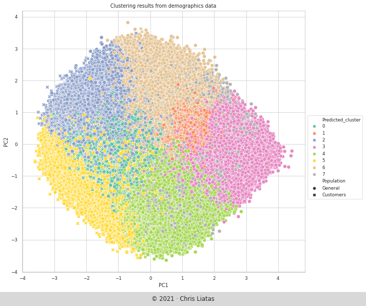
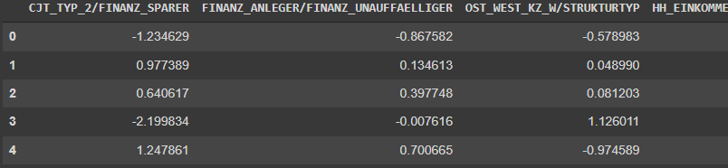

# Bertelsmann - Arvato challenge capstone project

Segmenting demographics data samples with PCA and k-means and building a LightGBM model for a targeted mailout marketing campaign.

## Motivation

Working on data for customers of a mail-order sales company in Germany, aiming to:

* Analyze demographics comparing it against demographics information for the general population and create population clusters with specific characteristics using unsupervised learning techniques.
* Utilize this population segmentation on a third dataset to assist a supervised learning model in  predicting which individuals are most likely to be targeted for potential customers for the company.

In this context, what we specifically wanted to look in these datasets is:

1. The dominant characteristics (attributes) that can be used to define population segments.
2. How are the defined clusters, compared between the two population datasets (general vs. customers) in terms of population distribution.
3. The cluster(s) that can be chosen to specifically target with a mail-out campaign.
4. Considering the above, if we can predict probabilities for potential customers from a third population demographics dataset.

### Presentation

Please read my related article with results presentation and analysis ["Population clustering and marketing campaign target prediction using LightGBM"](https://medium.com/@cliatas/population-clustering-and-marketing-campaign-target-prediction-using-lightgbm-11d0da882124).
An `.html` version of the Jupyter notebook is included in the repository files.

### The data

There are four data files associated with this project:

* `Udacity_AZDIAS_052018.csv`: Demographics data for the general population of Germany; 891 211 persons (rows) x 366 features (columns).
* `Udacity_CUSTOMERS_052018.csv`: Demographics data for customers of a mail-order company; 191 652 persons (rows) x 369 features (columns).
* `Udacity_MAILOUT_052018_TRAIN.csv`: Demographics data for individuals who were targets of a marketing campaign; 42 982 persons (rows) x 367 (columns).
* `Udacity_MAILOUT_052018_TEST.csv`: Demographics data for individuals who were targets of a marketing campaign; 42 833 persons (rows) x 366 (columns).

*These datasets are provided by Udacity and [Arvato Financial Services](https://finance.arvato.com/en/) for this capstone project and are protected by specific terms and conditions prohibiting sharing.*

In addition there were two Excel spreadsheets provided, to facilitate data understanding and exploration:

* `DIAS Information Levels - Attributes 2017.xlsx`: a top-level list of attributes and descriptions, organized by informational category.
* `DIAS Attributes - Values 2017.xlsx`: a detailed mapping of data values for each feature in alphabetical order.

### Environment

The development environment used for working with the project was [Google's Colab](https://colab.research.google.com/) spaces, with Python 3.7 and most common packages for data science:

* jupyter
* pandas
* numpy
* matplotlib
* seaborn
* scikit-learn

In addition, the packages [LightGBM](https://github.com/microsoft/LightGBM),  [kneed](https://github.com/arvkevi/kneed) and [kaggle python api](https://github.com/Kaggle/kaggle-api) were used.

## Results

The datasets we had to work with were quite large requiring a lot of cleaning and fixing to prepare them for our unsupervised and supervised learning models. Segmentation and finally supervised learning models comparison were certainly more fun. So, results briefly may be summed up:

1. **Dominant attributes defining population segments**, are defined with PCA, in a dataframe with the two highest influencing attributes names in each component used to rename each principal component (PC), providing thus an immediate view of the major characteristics in a PC.

2. **Cluster population distribution per dataset.** Figure shows a comparative visualization of populations' distribution percentage per cluster:

3. **Clusters specifically chosen to target for a mail-out campaign.** We may propose at least *two* clusters that may be stronger candidates for a mail-out marketing campaign:

4. **Probabilities prediction for potential customers from a third population demographics dataset.** Using LightGBM Classifier for the final probability predictions on `mailout_test` dataset produced an overall test `AUC` score of 0.74–0.76.

### Kaggle Competition

The project concludes with submission of the predicted probabilities to the relevant [Kaggle competition](http://www.kaggle.com/t/21e6d45d4c574c7fa2d868f0e8c83140). However, by the time I was able to make these predictions with my selected model the competition had closed, not accepting any more submissions.

## Acknowledgments

* This project has been created as part of the [Udacity Data Science Nanodegree](https://www.udacity.com/course/data-scientist-nanodegree--nd025) course.
* Data is provided by [Arvato Financial Services](https://finance.arvato.com/en/).